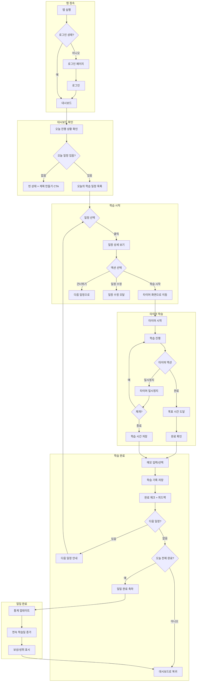
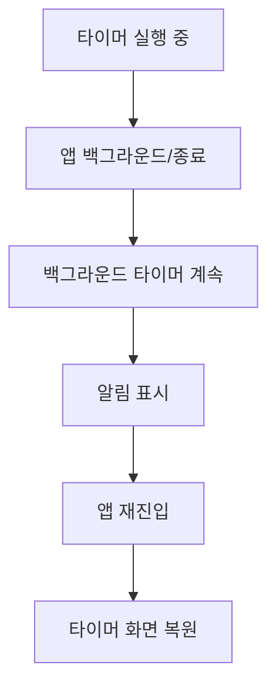
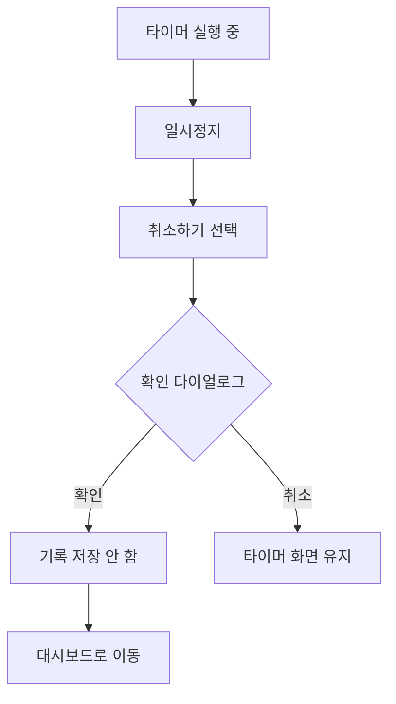
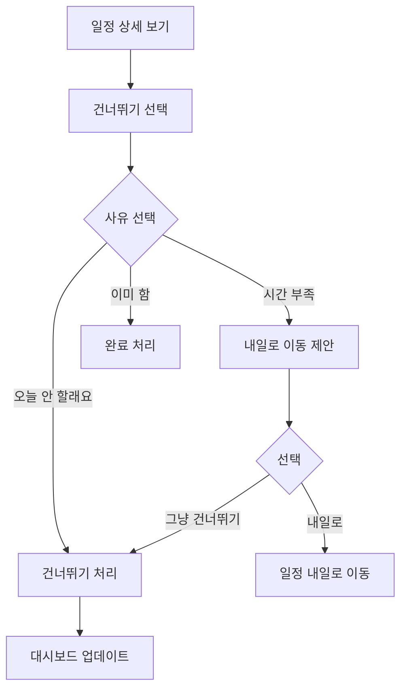
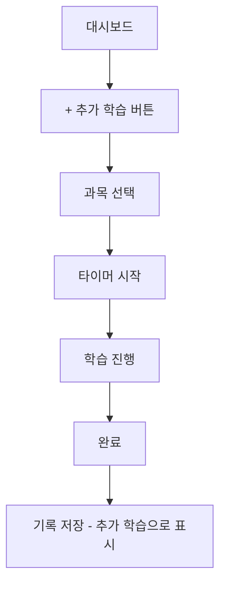
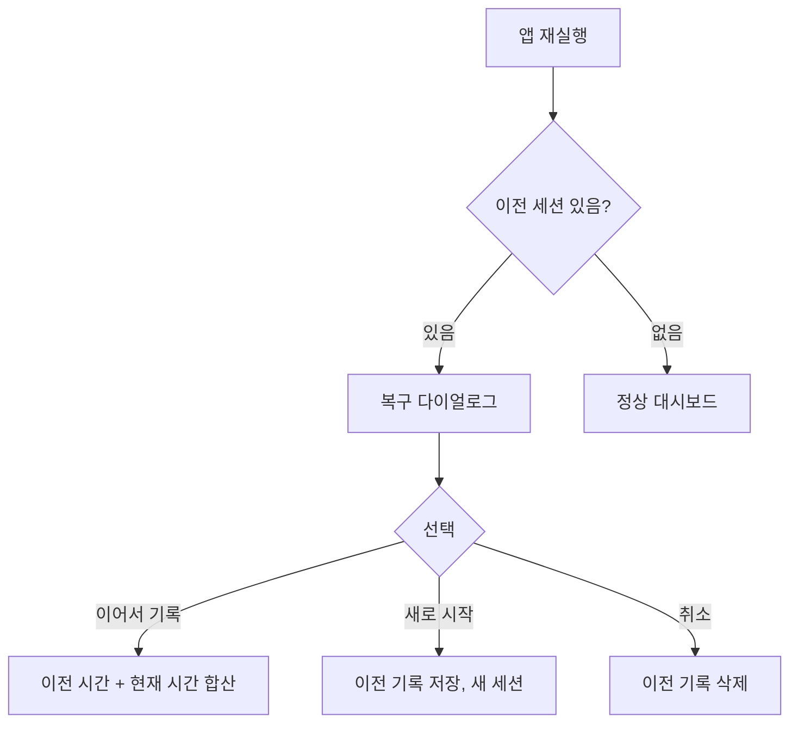

# StudyMate Daily Study Flow

## Overview

- **목적**: 사용자가 매일 계획된 학습을 확인하고, 타이머로 학습하며, 완료를 기록하는 일상적인 사용 흐름
- **시작점**: 앱 접속 (대시보드)
- **종료점**: 오늘 학습 완료 또는 일시 중단
- **빈도**: 매일 반복되는 핵심 플로우
- **목표**: 학습 습관 형성, 성취감 제공

---

## Flow Diagram (Full)



---

## Scene 1: 대시보드

### 화면 경로
`/dashboard`

### 목적
오늘 학습 상황 한눈에 파악, 빠른 학습 시작

### Wireframe

```
┌─────────────────────────────────────────────┐
│  [Logo]                          [알림] [설정]│ Header
├─────────────────────────────────────────────┤
│                                             │
│    안녕, 민수님!                             │ 인사
│    오늘도 화이팅!                            │
│                                             │
│    ┌─────────────────────────────────┐      │
│    │  오늘의 진행률                   │      │ Progress Card
│    │                                 │      │
│    │  [==========          ] 50%     │      │
│    │  3/6 완료                       │      │
│    │                                 │      │
│    │  연속 학습 7일째!               │      │
│    └─────────────────────────────────┘      │
│                                             │
│    ──────────────────────────────────       │
│                                             │
│    오늘의 학습                               │ Section Title
│                                             │
│    ┌─────────────────────────────────┐      │
│    │  [Check] 수학 - 미적분           │      │ 완료
│    │          16:00-17:00 | 1시간    │      │
│    └─────────────────────────────────┘      │
│    ┌─────────────────────────────────┐      │
│    │  [Check] 영어 - 독해             │      │ 완료
│    │          17:00-17:30 | 30분     │      │
│    └─────────────────────────────────┘      │
│    ┌─────────────────────────────────┐      │
│    │  [Circle] 국어                  │      │ 현재 (강조)
│    │           17:30-18:00 | 30분    │      │
│    │  [    지금 시작하기    ]         │      │
│    └─────────────────────────────────┘      │
│    ┌─────────────────────────────────┐      │
│    │  [Circle] 수학 - 복습            │      │ 대기
│    │           19:00-20:00 | 1시간    │      │
│    └─────────────────────────────────┘      │
│                                             │
├─────────────────────────────────────────────┤
│  [대시보드] [캘린더] [+ 계획] [기록] [설정]   │ Bottom Tab
└─────────────────────────────────────────────┘
```

### States

#### 빈 상태 (계획 없음)

```
┌─────────────────────────────────────────────┐
│                                             │
│              [Empty Illustration]           │
│                                             │
│         아직 학습 계획이 없어요               │
│                                             │
│    계획을 만들면 매일 오늘 할 일을            │
│    알려드릴게요!                             │
│                                             │
│    [     첫 계획 만들기     ]                │
│                                             │
└─────────────────────────────────────────────┘
```

#### 오늘 일정 없음

```
┌─────────────────────────────────────────────┐
│                                             │
│              [Rest Illustration]            │
│                                             │
│         오늘은 쉬는 날이에요                  │
│                                             │
│    다음 학습: 내일 오후 4시                   │
│                                             │
│    [  추가 학습 기록하기  ]                   │ 선택적
│                                             │
└─────────────────────────────────────────────┘
```

#### 모두 완료

```
┌─────────────────────────────────────────────┐
│                                             │
│              [Celebration Icon]             │
│                                             │
│         오늘 학습 완료!                      │
│                                             │
│    총 3시간 30분 공부했어요                  │
│    연속 8일째 학습 중!                       │
│                                             │
│    내일도 화이팅!                            │
│                                             │
└─────────────────────────────────────────────┘
```

### Interaction Details

| 요소 | 인터랙션 | 결과 |
|------|----------|------|
| 일정 카드 | 탭 | 상세 보기 모달 |
| "지금 시작하기" | 탭 | 타이머 화면 이동 |
| 완료된 일정 | 탭 | 기록 상세 보기 |
| 진행률 카드 | 탭 | 주간 통계 페이지 |

---

## Scene 2: 일정 상세 보기

### 화면 (Bottom Sheet)

```
┌─────────────────────────────────────────────┐
│  ──────                                     │ 핸들
├─────────────────────────────────────────────┤
│                                             │
│    국어                                     │ 과목
│    17:30 - 18:00                           │ 시간
│                                             │
│    목표 시간: 30분                          │
│                                             │
│    학습 범위                                │
│    비문학 지문 3개                          │
│                                             │
│    ──────────────────────────────────       │
│                                             │
│    [    학습 시작    ]                      │ Primary CTA
│                                             │
│    [시간 변경]  [건너뛰기]  [삭제]           │ Secondary
│                                             │
└─────────────────────────────────────────────┘
```

### Actions

| 액션 | 설명 | 결과 |
|------|------|------|
| 학습 시작 | 타이머와 함께 학습 시작 | 타이머 화면으로 이동 |
| 시간 변경 | 시작 시간 수정 | 시간 선택 피커 |
| 건너뛰기 | 오늘 이 일정 건너뜀 | 다음 일정으로 표시 변경 |
| 삭제 | 일정 삭제 | 확인 다이얼로그 |

---

## Scene 3: 타이머 화면

### 화면 경로
`/records/timer` 또는 `/study`

### 목적
집중 학습 환경 제공, 시간 자동 기록

### Wireframe - 타이머 진행 중

```
┌─────────────────────────────────────────────┐
│  ←                  국어                    │ Header
├─────────────────────────────────────────────┤
│                                             │
│                                             │
│                                             │
│              목표: 30분                     │
│                                             │
│         ┌─────────────────────┐             │
│         │                     │             │
│         │       15:24         │             │ 타이머 (큰 폰트)
│         │                     │             │
│         │   [=======    ]     │             │ 진행 바
│         │                     │             │
│         └─────────────────────┘             │
│                                             │
│            51% 완료                         │
│                                             │
│                                             │
│              [일시정지]                      │ 원형 버튼
│                                             │
│                                             │
│    [학습 종료]                              │ 텍스트 링크
│                                             │
│                                             │
│    * 화면을 끄면 타이머가 계속 동작해요       │ 안내
│                                             │
└─────────────────────────────────────────────┘
```

### Wireframe - 일시정지 상태

```
┌─────────────────────────────────────────────┐
│  ←                  국어                    │
├─────────────────────────────────────────────┤
│                                             │
│                                             │
│              목표: 30분                     │
│                                             │
│         ┌─────────────────────┐             │
│         │                     │             │
│         │       15:24         │             │ 흐린 표시
│         │       일시정지       │             │
│         │                     │             │
│         └─────────────────────┘             │
│                                             │
│                                             │
│              [재개하기]                      │ Primary
│                                             │
│       [여기서 종료]    [취소하기]            │ Secondary
│                                             │
│                                             │
└─────────────────────────────────────────────┘
```

### Wireframe - 목표 시간 도달

```
┌─────────────────────────────────────────────┐
│                                             │
│                                             │
│              [Check Animation]              │
│                                             │
│              30분 완료!                     │
│                                             │
│         목표 시간을 달성했어요               │
│                                             │
│                                             │
│    [    학습 완료하기    ]                   │ Primary
│                                             │
│         조금 더 공부하기                     │ 텍스트 링크
│                                             │
│                                             │
└─────────────────────────────────────────────┘
```

### Timer States

| 상태 | UI 표시 | 가능한 액션 |
|------|---------|------------|
| Running | 타이머 카운트업, 진행 바 애니메이션 | 일시정지, 학습 종료 |
| Paused | "일시정지" 표시, 흐린 타이머 | 재개, 종료, 취소 |
| Goal Reached | 축하 애니메이션, 완료 버튼 | 완료하기, 더 공부하기 |
| Overtime | 타이머 계속 진행, "+추가시간" 표시 | 완료하기 |

### Background Behavior

- 앱이 백그라운드로 가도 타이머 계속 동작
- 알림으로 진행 상태 표시
- 목표 시간 도달 시 알림

---

## Scene 4: 학습 완료

### 화면 (모달 또는 페이지)

```
┌─────────────────────────────────────────────┐
│                학습 완료                     │
├─────────────────────────────────────────────┤
│                                             │
│    국어                                     │
│    학습 시간: 32분                          │
│                                             │
│    ──────────────────────────────────       │
│                                             │
│    오늘 공부 어땠어요?                       │
│                                             │
│    ┌─────────────────────────────────┐      │
│    │  [Good]   [Okay]   [Hard]       │      │ 이모지 선택
│    │   잘됐어   보통     어려웠어      │      │
│    └─────────────────────────────────┘      │
│                                             │
│    메모 (선택)                              │
│    ┌─────────────────────────────────┐      │
│    │  오늘 배운 내용, 어려웠던 점...   │      │
│    │  [_________________________]    │      │
│    └─────────────────────────────────┘      │
│                                             │
│    ──────────────────────────────────       │
│                                             │
│    빠른 메모 태그                            │
│    [개념 이해]  [문제 풀이]  [복습 필요]      │
│    [시간 부족]  [집중 잘됨]                  │
│                                             │
│                                             │
│    [        완료        ]                   │
│                                             │
└─────────────────────────────────────────────┘
```

### Interaction Details

| 요소 | 필수 여부 | 설명 |
|------|----------|------|
| 감정 선택 | 선택 | 학습 만족도 기록 |
| 메모 | 선택 | 자유 텍스트 입력 |
| 빠른 메모 태그 | 선택 | 탭으로 빠른 기록, 복수 선택 가능 |

---

## Scene 5: 완료 피드백

### 중간 완료 (남은 일정 있음)

```
┌─────────────────────────────────────────────┐
│                                             │
│              [Check Icon]                   │
│                                             │
│              국어 완료!                      │
│                                             │
│    오늘 3/6 완료                            │
│                                             │
│    다음 일정: 수학 (19:00)                   │
│                                             │
│    [  다음 학습 시작  ]    [대시보드로]       │
│                                             │
└─────────────────────────────────────────────┘
```

### 일일 완료

```
┌─────────────────────────────────────────────┐
│                                             │
│              [Trophy Animation]             │
│              [Confetti]                     │
│                                             │
│         오늘의 학습 완료!                    │
│                                             │
│    ┌─────────────────────────────────┐      │
│    │                                 │      │
│    │   총 학습 시간: 3시간 30분       │      │
│    │                                 │      │
│    │   수학: 1시간 30분              │      │
│    │   영어: 1시간                   │      │
│    │   국어: 1시간                   │      │
│    │                                 │      │
│    └─────────────────────────────────┘      │
│                                             │
│    ──────────────────────────────────       │
│                                             │
│         연속 학습 8일째!                     │ 강조
│         이번 주 평균보다 30분 더 공부했어요   │
│                                             │
│                                             │
│    [        대시보드로        ]              │
│                                             │
└─────────────────────────────────────────────┘
```

### 연속 학습 마일스톤

```
┌─────────────────────────────────────────────┐
│                                             │
│              [Badge Animation]              │
│                                             │
│         7일 연속 학습 달성!                  │
│                                             │
│         "꾸준한 학습자" 배지 획득            │
│                                             │
│    [  SNS 공유  ]    [확인]                 │
│                                             │
└─────────────────────────────────────────────┘
```

---

## Alternative Paths

### 1. 학습 중간에 앱 종료



### 2. 학습 취소



**확인 다이얼로그**:
```
학습을 취소할까요?

지금까지의 기록이 저장되지 않아요.

[계속 공부하기]  [취소하기]
```

### 3. 일정 건너뛰기



### 4. 추가 학습 (계획 외)



---

## Error Handling

### 에러 상태별 처리

| 에러 | 상황 | 복구 방법 |
|------|------|----------|
| 타이머 동기화 실패 | 서버 저장 실패 | 로컬 저장 후 나중에 동기화 |
| 앱 크래시 | 타이머 실행 중 | 다음 실행 시 복구 안내 |
| 네트워크 오류 | 완료 저장 시 | 오프라인 저장 + 재시도 버튼 |

### 타이머 복구 플로우



---

## Notifications

### 알림 유형

| 알림 | 트리거 | 내용 |
|------|--------|------|
| 학습 시작 리마인더 | 예정 시간 5분 전 | "국어 학습 시간이에요! 지금 시작할까요?" |
| 타이머 진행 중 | 백그라운드 상태 | "국어 공부 중 - 15:24 / 30:00" |
| 목표 시간 도달 | 타이머 완료 | "수고했어요! 국어 30분 완료!" |
| 일일 목표 달성 | 모든 일정 완료 | "오늘 학습 완료! 3시간 30분 공부했어요" |
| 연속 학습 위험 | 오늘 학습 없이 22시 | "오늘 학습 기록이 없어요. 연속 7일 유지하기!" |

---

## Gamification Elements

### 연속 학습 (Streak)

| 일수 | 배지 | 보상 |
|------|------|------|
| 3일 | "시작이 반" | - |
| 7일 | "꾸준한 학습자" | - |
| 14일 | "2주 챔피언" | - |
| 30일 | "한 달 마스터" | - |
| 100일 | "레전드 학습자" | - |

### 일일 완료 피드백

| 상황 | 메시지 예시 |
|------|------------|
| 목표 시간 달성 | "목표 시간 달성! 대단해요!" |
| 목표 초과 달성 | "와! 30분 더 공부했어요!" |
| 모든 과목 완료 | "오늘 할 일 모두 완료!" |
| 이번 주 최고 | "이번 주 최고 기록이에요!" |

---

## UX Considerations

### 핵심 UX 원칙 적용

| 원칙 | 적용 |
|------|------|
| **시스템 상태 가시성** | 타이머 진행, 진행률, 알림 |
| **사용자 제어** | 일시정지, 취소, 건너뛰기 |
| **에러 예방** | 학습 취소 전 확인 |
| **피드백** | 완료 시 축하, 마일스톤 알림 |
| **유연성** | 추가 학습, 일정 수정 가능 |

### 마찰 최소화

| 목표 | 구현 |
|------|------|
| 빠른 학습 시작 | 대시보드에서 1탭으로 시작 |
| 빠른 완료 기록 | 감정 선택 + 빠른 태그 |
| 중단 시 데이터 보존 | 자동 임시 저장 |

### 동기 부여

| 요소 | 목적 |
|------|------|
| 연속 학습 스트릭 | 매일 학습 습관 형성 |
| 진행률 시각화 | 성취감, 완료 욕구 |
| 완료 축하 애니메이션 | 즉각적 보상 |
| 배지 시스템 | 장기 목표 |

---

## Accessibility

- [ ] 타이머: 스크린 리더로 현재 시간 읽기
- [ ] 큰 버튼 (일시정지/재개): 최소 56x56px
- [ ] 색상 외 아이콘으로 상태 구분
- [ ] 진동 피드백 (완료 시)
- [ ] 음성 알림 옵션

---

## Analytics Events

| 이벤트 | 트리거 | 속성 |
|--------|--------|------|
| study_started | 타이머 시작 | subject, planned_duration, source |
| study_paused | 일시정지 | elapsed_time |
| study_resumed | 재개 | pause_duration |
| study_completed | 완료 버튼 | actual_duration, planned_duration, mood |
| study_cancelled | 취소 | elapsed_time, reason |
| daily_goal_achieved | 일일 완료 | total_time, subjects_count |
| streak_milestone | 마일스톤 달성 | streak_days |

---

## Related Documents

- [전체 플로우 개요](./user-flows.md)
- [온보딩 플로우](./flow-onboarding.md)
- [계획 생성 플로우](./flow-plan-creation.md)
- [와이어프레임 - 대시보드](/design/wireframes/dashboard.md)
- [와이어프레임 - 타이머](/design/wireframes/timer.md)
