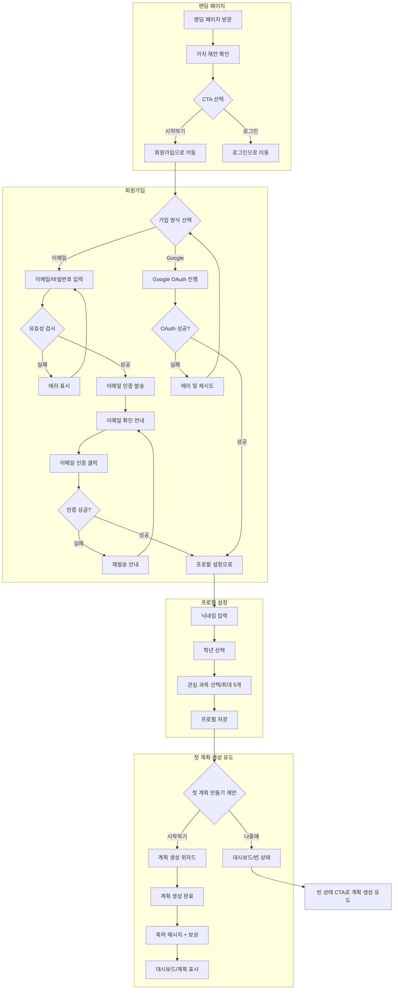
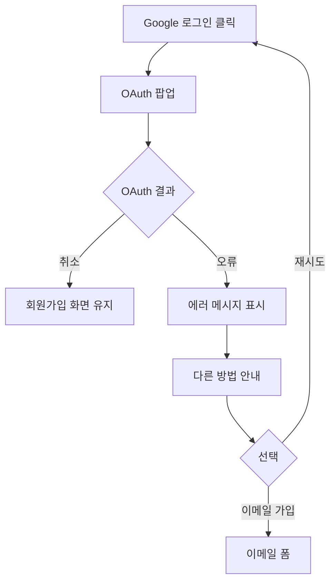
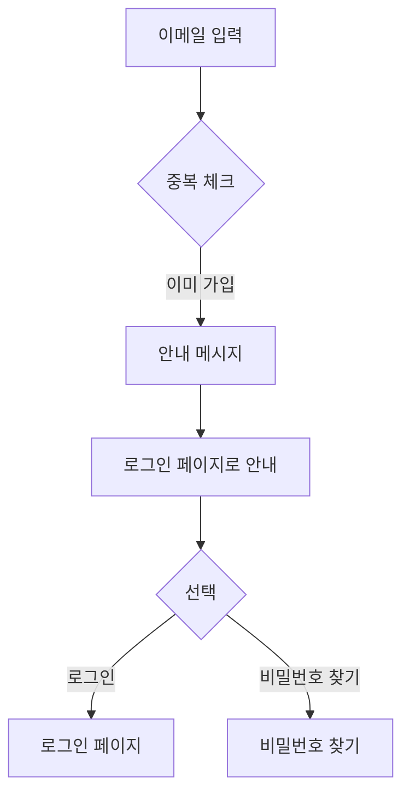
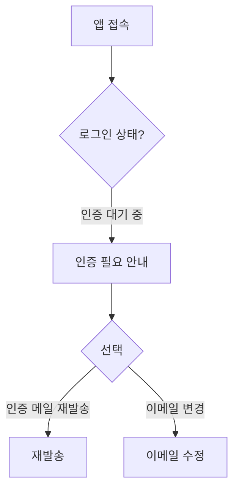

# StudyMate Onboarding Flow

## Overview

- **목적**: 신규 사용자가 서비스에 가입하고 첫 계획을 만들어 핵심 가치를 경험하게 함
- **시작점**: 랜딩 페이지 (`/`)
- **종료점**: 대시보드 (`/dashboard`)
- **예상 소요 시간**: 3-5분 (첫 계획 생성 포함)
- **목표 전환율**: 회원가입 시작 -> 첫 계획 생성 완료 70% 이상

---

## Flow Diagram (Full)



---

## Step-by-Step Details

### Step 1: 랜딩 페이지

**화면 경로**: `/`

**목적**: 서비스 가치 전달 및 회원가입 유도

**화면 구성**:
```
┌─────────────────────────────────────────────┐
│ [Logo]                     [로그인] [시작하기] │ Header
├─────────────────────────────────────────────┤
│                                             │
│        공부 계획, 이제 혼자서도 쉽게          │ Hero
│                                             │
│   StudyMate가 맞춤형 학습 계획을 만들어드려요  │
│                                             │
│         [무료로 시작하기 - Primary]           │
│                                             │
├─────────────────────────────────────────────┤
│                                             │
│    [Feature 1]  [Feature 2]  [Feature 3]    │ Features
│    가이드형      자동 시간     학습 기록       │
│    계획 생성     배분         및 통계         │
│                                             │
├─────────────────────────────────────────────┤
│                                             │
│           사용 후기 / 통계                    │ Social Proof
│                                             │
├─────────────────────────────────────────────┤
│              [지금 시작하기]                  │ Final CTA
│                                             │
└─────────────────────────────────────────────┘
```

**인터랙션**:
- "시작하기" / "무료로 시작하기" 클릭 -> `/signup`
- "로그인" 클릭 -> `/login`
- 이미 로그인 상태 -> `/dashboard`로 자동 리다이렉트

**UX 고려사항**:
- [ ] CTA 버튼 충분히 크게 (최소 48px 높이)
- [ ] 가치 제안 3초 내 이해 가능하도록
- [ ] 모바일에서 Hero 영역이 화면 전체 차지

---

### Step 2: 회원가입

**화면 경로**: `/signup`

**목적**: 최소 정보로 빠르게 가입

#### 2-1. 가입 방식 선택

```
┌─────────────────────────────────────────────┐
│ ←                 회원가입                   │ Header
├─────────────────────────────────────────────┤
│                                             │
│                 [Logo]                      │
│                                             │
│         StudyMate 시작하기                   │
│                                             │
│    ┌─────────────────────────────────┐      │
│    │  [G] Google로 계속하기           │      │ 소셜 로그인
│    └─────────────────────────────────┘      │ (권장)
│                                             │
│           ────── 또는 ──────                │
│                                             │
│    ┌─────────────────────────────────┐      │
│    │  이메일                          │      │
│    │  [_________________________]    │      │
│    └─────────────────────────────────┘      │
│    ┌─────────────────────────────────┐      │
│    │  비밀번호                        │      │
│    │  [_________________________]    │      │
│    └─────────────────────────────────┘      │
│    ┌─────────────────────────────────┐      │
│    │  비밀번호 확인                    │      │
│    │  [_________________________]    │      │
│    └─────────────────────────────────┘      │
│                                             │
│    [        이메일로 가입하기         ]      │
│                                             │
│    이미 계정이 있나요? 로그인                 │
│                                             │
│    가입 시 이용약관과 개인정보처리방침에       │
│    동의하는 것으로 간주됩니다.                │
│                                             │
└─────────────────────────────────────────────┘
```

**유효성 검사 규칙**:

| 필드 | 규칙 | 에러 메시지 |
|------|------|------------|
| 이메일 | 이메일 형식 | "올바른 이메일 형식이 아닙니다" |
| 이메일 | 중복 체크 | "이미 가입된 이메일입니다" |
| 비밀번호 | 8자 이상 | "비밀번호는 8자 이상이어야 합니다" |
| 비밀번호 | 영문+숫자 | "영문과 숫자를 포함해야 합니다" |
| 비밀번호 확인 | 일치 | "비밀번호가 일치하지 않습니다" |

**인터랙션**:
- 실시간 유효성 검사 (타이핑 중)
- 비밀번호 표시/숨김 토글
- 가입 버튼: 모든 필드 유효 시 활성화

#### 2-2. 이메일 인증 (이메일 가입 시)

```
┌─────────────────────────────────────────────┐
│                                             │
│              [Email Icon]                   │
│                                             │
│         이메일을 확인해주세요                 │
│                                             │
│    user@email.com으로 인증 메일을            │
│    보냈습니다. 메일함을 확인해주세요.          │
│                                             │
│    [      이메일 앱 열기       ]             │
│                                             │
│    메일이 안 왔나요?                         │
│    [다시 보내기]  |  [이메일 수정하기]         │
│                                             │
└─────────────────────────────────────────────┘
```

**에러 케이스**:
- 인증 링크 만료 (24시간): "링크가 만료되었습니다. 다시 보내드릴까요?"
- 잘못된 토큰: "유효하지 않은 링크입니다. 다시 시도해주세요."

---

### Step 3: 프로필 설정

**화면 경로**: `/onboarding/profile`

**목적**: 개인화를 위한 최소 정보 수집

```
┌─────────────────────────────────────────────┐
│              프로필 설정                     │ Header
├─────────────────────────────────────────────┤
│                                             │
│    Step 1/3                                 │ Progress
│    [====--------]                           │
│                                             │
│    반가워요! 몇 가지만 알려주세요             │
│                                             │
│    닉네임                                   │
│    ┌─────────────────────────────────┐      │
│    │  [_________________________]    │      │
│    └─────────────────────────────────┘      │
│    * 2-10자, 특수문자 불가                   │
│                                             │
│    학년                                     │
│    ┌─────────────────────────────────┐      │
│    │  고1  │  고2  │  고3  │  N수   │      │
│    └─────────────────────────────────┘      │
│                                             │
│                                             │
│    [            다음            ]            │
│                                             │
└─────────────────────────────────────────────┘
```

```
┌─────────────────────────────────────────────┐
│              프로필 설정                     │ Header
├─────────────────────────────────────────────┤
│                                             │
│    Step 2/3                                 │ Progress
│    [========----]                           │
│                                             │
│    주로 공부하는 과목을 선택해주세요           │
│    (최대 5개)                               │
│                                             │
│    ┌─────────────────────────────────┐      │
│    │ 국어 계열                        │      │
│    │ [국어] [문학] [독서]             │      │
│    └─────────────────────────────────┘      │
│    ┌─────────────────────────────────┐      │
│    │ 수학 계열                        │      │
│    │ [수학] [수학I] [수학II] [미적분]  │      │
│    │ [확률과통계] [기하]              │      │
│    └─────────────────────────────────┘      │
│    ┌─────────────────────────────────┐      │
│    │ 영어 계열                        │      │
│    │ [영어] [영어I] [영어II]          │      │
│    └─────────────────────────────────┘      │
│    ┌─────────────────────────────────┐      │
│    │ 탐구 계열                        │      │
│    │ [물리] [화학] [생명과학] [지구과학]│     │
│    │ [한국사] [사회문화] [경제]...     │      │
│    └─────────────────────────────────┘      │
│                                             │
│    선택됨: 3/5                              │
│                                             │
│    [이전]                [다음]             │
│                                             │
└─────────────────────────────────────────────┘
```

**인터랙션**:
- 과목 선택은 토글 (Chip 스타일)
- 5개 선택 시 추가 선택 비활성화 + 안내
- "다음" 버튼: 최소 1개 선택 시 활성화

---

### Step 4: 첫 계획 생성 제안

**화면 경로**: `/onboarding/first-plan`

**목적**: 핵심 기능 사용 유도

```
┌─────────────────────────────────────────────┐
│              프로필 설정                     │ Header
├─────────────────────────────────────────────┤
│                                             │
│    Step 3/3                                 │ Progress
│    [============]                           │
│                                             │
│              [Checkmark Icon]               │
│                                             │
│         프로필 설정 완료!                    │
│                                             │
│    이제 첫 번째 학습 계획을 만들어볼까요?     │
│                                             │
│    StudyMate의 가이드를 따라가면             │
│    3분 안에 맞춤 계획이 완성됩니다.           │
│                                             │
│    [    첫 계획 만들기 - Primary    ]        │ 권장
│                                             │
│          나중에 할게요                       │ 텍스트 링크
│                                             │
└─────────────────────────────────────────────┘
```

**분기 처리**:

| 선택 | 이동 경로 | 결과 |
|------|----------|------|
| 첫 계획 만들기 | `/plan/new?from=onboarding` | 계획 생성 위자드 시작 |
| 나중에 할게요 | `/dashboard` | 빈 대시보드 (CTA 포함) |

---

### Step 5: 계획 생성 (선택 시)

계획 생성 위자드로 이동합니다.
상세 내용은 [flow-plan-creation.md](./flow-plan-creation.md) 참조.

**온보딩 컨텍스트 특징**:
- 프로필에서 선택한 과목이 미리 선택됨
- 더 친절한 가이드 툴팁 표시
- 첫 계획 생성 완료 시 특별 보상/축하 메시지

---

### Step 6: 온보딩 완료

**화면 경로**: `/dashboard` (완료 모달 포함)

```
┌─────────────────────────────────────────────┐
│                                             │
│              [Celebration Icon]             │
│                                             │
│              축하합니다!                     │
│                                             │
│         첫 학습 계획이 완성되었어요           │
│                                             │
│    ┌─────────────────────────────────┐      │
│    │  중간고사 대비                   │      │
│    │  5과목 | 14일 | 42시간           │      │
│    └─────────────────────────────────┘      │
│                                             │
│    이제 대시보드에서 오늘의 학습을            │
│    시작해보세요!                             │
│                                             │
│    [    대시보드로 이동    ]                 │
│                                             │
└─────────────────────────────────────────────┘
```

---

## Alternative Paths

### 1. Google 로그인 실패



**에러 메시지**:
- 사용자 취소: (메시지 없음, 화면 유지)
- 네트워크 오류: "연결에 실패했습니다. 다시 시도해주세요."
- 계정 오류: "Google 계정에 문제가 있습니다. 이메일로 가입해주세요."

### 2. 기존 회원이 가입 시도



**메시지**: "이미 가입된 이메일입니다. 로그인하시겠어요?"

### 3. 이메일 인증 없이 재방문



---

## Error Handling

### 에러 상태별 처리

| 에러 | 메시지 | 액션 |
|------|--------|------|
| 네트워크 오류 | "연결에 실패했습니다" | [다시 시도] 버튼 |
| 서버 오류 | "일시적인 오류가 발생했습니다" | [다시 시도] 버튼 |
| 유효성 오류 | 필드별 구체적 메시지 | 필드 하단 인라인 표시 |
| 인증 링크 만료 | "인증 링크가 만료되었습니다" | [재발송] 버튼 |

---

## UX Checklist

### Nielsen Heuristics

- [x] **시스템 상태 가시성**: 프로필 설정 진행률 표시
- [x] **실제 세계와 일치**: "학년", "과목" 등 학생에게 익숙한 용어
- [x] **사용자 제어와 자유**: "나중에 할게요" 옵션, 이전 버튼
- [x] **일관성**: 버튼 스타일, 폼 레이아웃 통일
- [x] **에러 예방**: 실시간 유효성 검사
- [x] **기억보다 인식**: 프로필에서 선택한 과목 계획에 자동 반영
- [x] **유연성과 효율성**: Google 로그인으로 빠른 가입
- [x] **미니멀 디자인**: 필수 정보만 수집
- [x] **에러 복구**: 명확한 에러 메시지 + 해결 방법
- [x] **도움말**: 각 단계별 안내 텍스트

### Friction Minimization

- [x] 필수 입력 최소화 (닉네임, 학년만 필수)
- [x] Google 로그인으로 즉시 가입 가능
- [x] 첫 계획 생성을 "나중에" 가능
- [x] 과목 선택에서 프리셋 제공 (학년별 추천)

### Accessibility

- [x] 모든 폼 필드에 라벨
- [x] 에러 메시지 색상 외에 아이콘으로도 표시
- [x] 키보드 네비게이션 지원
- [x] 적절한 터치 타겟 크기 (44x44px 이상)

---

## Metrics & Success Criteria

| 지표 | 목표 | 측정 방법 |
|------|------|----------|
| 가입 완료율 | 80% | 가입 시작 -> 이메일 인증 완료 |
| 프로필 완료율 | 95% | 인증 완료 -> 프로필 저장 |
| 첫 계획 생성율 | 70% | 프로필 완료 -> 계획 생성 완료 |
| 온보딩 이탈율 | 20% 미만 | 각 단계별 이탈 |
| 평균 온보딩 시간 | 3분 | 가입 시작 -> 대시보드 도착 |

---

## Related Documents

- [전체 플로우 개요](./user-flows.md)
- [계획 생성 플로우](./flow-plan-creation.md)
- [와이어프레임 - 회원가입](/design/wireframes/signup.md)
- [와이어프레임 - 온보딩](/design/wireframes/onboarding.md)
