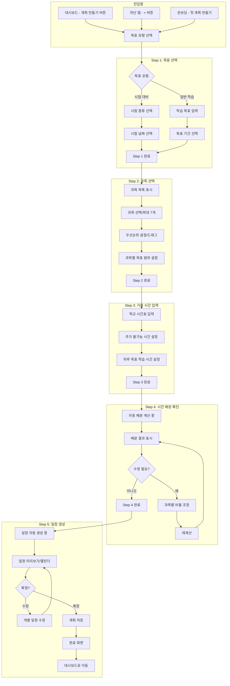
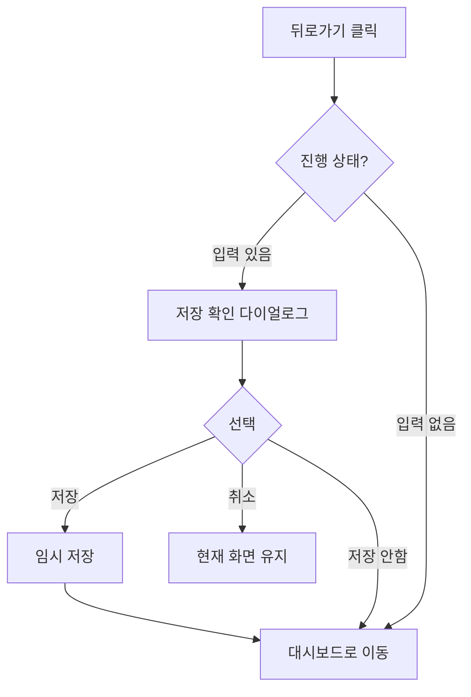
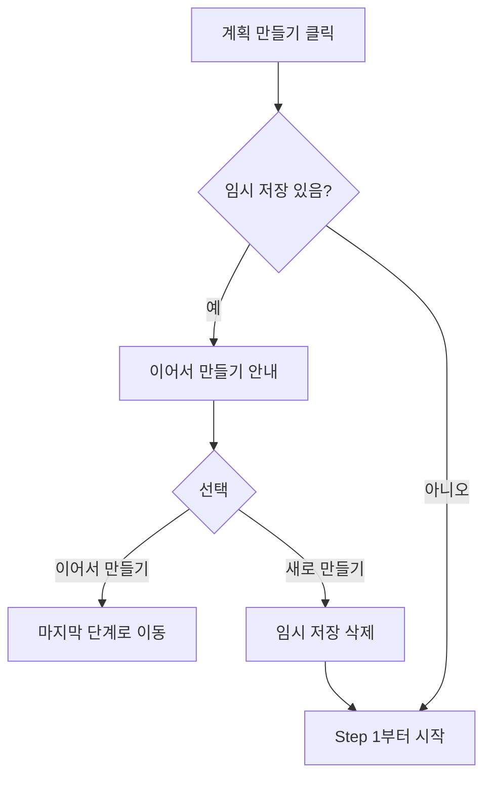
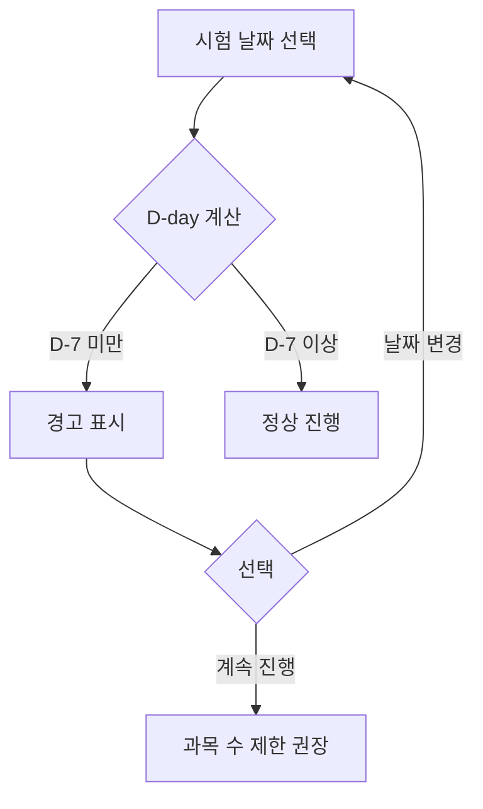

# StudyMate Plan Creation Flow

## Overview

- **목적**: 사용자가 학습 목표에 맞는 맞춤형 공부 계획을 단계별 가이드로 쉽게 생성
- **시작점**: 대시보드 "계획 만들기" 버튼 또는 온보딩 플로우
- **종료점**: 대시보드 (생성된 계획 표시)
- **예상 소요 시간**: 3-5분
- **차별화 포인트**: AI 기반 자동 시간 배분 및 일정 생성

---

## Flow Diagram (Full)



---

## Step 1: 목표 선택

### 화면 경로
`/plan/new/step1`

### 목적
학습 목표와 기간 설정

### Wireframe

```
┌─────────────────────────────────────────────┐
│  ←  계획 만들기                              │ Header
├─────────────────────────────────────────────┤
│                                             │
│    Step 1/5  목표 선택                       │ Progress
│    [==--------]                             │
│                                             │
│    어떤 목표로 공부할까요?                    │
│                                             │
│    ┌─────────────────────────────────┐      │
│    │  [Test Icon]                    │      │
│    │                                 │      │
│    │  시험 대비                       │      │ 옵션 카드
│    │  중간/기말고사, 모의고사 등       │      │ (라디오)
│    └─────────────────────────────────┘      │
│                                             │
│    ┌─────────────────────────────────┐      │
│    │  [Book Icon]                    │      │
│    │                                 │      │
│    │  일반 학습                       │      │
│    │  꾸준한 학습 계획               │      │
│    └─────────────────────────────────┘      │
│                                             │
│                                             │
│    [            다음            ]           │ 비활성
│                                             │
└─────────────────────────────────────────────┘
```

### 1-1. 시험 대비 선택 시

```
┌─────────────────────────────────────────────┐
│  ←  계획 만들기                              │
├─────────────────────────────────────────────┤
│                                             │
│    Step 1/5  목표 선택                       │
│    [==--------]                             │
│                                             │
│    어떤 시험을 준비하나요?                    │
│                                             │
│    시험 종류                                 │
│    ┌─────────────────────────────────┐      │
│    │  [중간고사]  [기말고사]          │      │
│    │  [모의고사]  [수능]              │      │
│    │  [기타 시험]                     │      │
│    └─────────────────────────────────┘      │
│                                             │
│    시험 날짜                                 │
│    ┌─────────────────────────────────┐      │
│    │  [Calendar] 2025년 3월 15일      │      │
│    └─────────────────────────────────┘      │
│                                             │
│    D-14 (오늘부터 14일)                      │
│                                             │
│    [            다음            ]           │
│                                             │
└─────────────────────────────────────────────┘
```

### 1-2. 일반 학습 선택 시

```
┌─────────────────────────────────────────────┐
│  ←  계획 만들기                              │
├─────────────────────────────────────────────┤
│                                             │
│    Step 1/5  목표 선택                       │
│    [==--------]                             │
│                                             │
│    학습 목표를 적어주세요                     │
│                                             │
│    목표 (선택)                               │
│    ┌─────────────────────────────────┐      │
│    │  예: 수학 기초 완성하기           │      │
│    │  [_________________________]    │      │
│    └─────────────────────────────────┘      │
│                                             │
│    학습 기간                                 │
│    ┌─────────────────────────────────┐      │
│    │  [1주]  [2주]  [4주]  [직접 선택]│      │
│    └─────────────────────────────────┘      │
│                                             │
│    * 직접 선택 시 달력 표시                   │
│                                             │
│    [            다음            ]           │
│                                             │
└─────────────────────────────────────────────┘
```

### Decision Points

| 분기점 | 조건 | 결과 |
|--------|------|------|
| 목표 유형 | 시험 대비 | 시험 종류 + 날짜 선택 UI |
| 목표 유형 | 일반 학습 | 목표 입력 + 기간 선택 UI |
| 시험 날짜 | D-7 미만 | 경고: "시험까지 시간이 부족해요" |
| 시험 날짜 | D-30 초과 | 권장: 2주 단위로 나눠서 계획 |

### Validation

| 필드 | 규칙 | 에러 메시지 |
|------|------|------------|
| 시험 종류 | 필수 선택 | "시험 종류를 선택해주세요" |
| 시험 날짜 | 오늘 이후 | "오늘 이후 날짜를 선택해주세요" |
| 학습 기간 | 1일 이상 | "최소 1일 이상의 기간이 필요해요" |

---

## Step 2: 과목 선택

### 화면 경로
`/plan/new/step2`

### 목적
학습할 과목과 우선순위 설정

### Wireframe

```
┌─────────────────────────────────────────────┐
│  ←  계획 만들기                              │
├─────────────────────────────────────────────┤
│                                             │
│    Step 2/5  과목 선택                       │
│    [====------]                             │
│                                             │
│    공부할 과목을 선택해주세요 (최대 7개)       │
│                                             │
│    ┌─────────────────────────────────┐      │
│    │ 국어 계열                        │      │
│    │ [국어] [문학] [독서]             │      │
│    └─────────────────────────────────┘      │
│    ┌─────────────────────────────────┐      │
│    │ 수학 계열                        │      │
│    │ [수학*] [수학I] [수학II] [미적분]│      │
│    │ [확률과통계] [기하]              │      │
│    └─────────────────────────────────┘      │
│    ┌─────────────────────────────────┐      │
│    │ 영어 계열                        │      │
│    │ [영어*] [영어I] [영어II]         │      │
│    └─────────────────────────────────┘      │
│    ┌─────────────────────────────────┐      │
│    │ 탐구 계열                        │      │
│    │ [물리] [화학] [생명과학] ...     │      │
│    └─────────────────────────────────┘      │
│                                             │
│    선택: 3/7개                              │
│    * 프로필에서 선택한 과목                   │
│                                             │
│    [이전]                [다음]             │
│                                             │
└─────────────────────────────────────────────┘
```

### 2-1. 우선순위 설정

```
┌─────────────────────────────────────────────┐
│  ←  계획 만들기                              │
├─────────────────────────────────────────────┤
│                                             │
│    Step 2/5  과목 선택                       │
│    [====------]                             │
│                                             │
│    드래그해서 우선순위를 정해주세요            │
│    위에 있을수록 더 많은 시간이 배분됩니다     │
│                                             │
│    ┌─────────────────────────────────┐      │
│    │  1. [|||] 수학          [Edit]  │      │
│    │     미적분 1-3단원              │      │
│    └─────────────────────────────────┘      │
│    ┌─────────────────────────────────┐      │
│    │  2. [|||] 영어          [Edit]  │      │
│    │     범위 미설정                 │      │
│    └─────────────────────────────────┘      │
│    ┌─────────────────────────────────┐      │
│    │  3. [|||] 국어          [Edit]  │      │
│    │     범위 미설정                 │      │
│    └─────────────────────────────────┘      │
│                                             │
│    [|||] = 드래그 핸들                       │
│                                             │
│    [이전]                [다음]             │
│                                             │
└─────────────────────────────────────────────┘
```

### 2-2. 과목별 목표 범위 설정 (Edit 클릭 시)

```
┌─────────────────────────────────────────────┐
│                수학 범위 설정                │ 모달
├─────────────────────────────────────────────┤
│                                             │
│    학습 범위 (선택)                          │
│    ┌─────────────────────────────────┐      │
│    │  예: 1-3단원, 함수 파트          │      │
│    │  [_________________________]    │      │
│    └─────────────────────────────────┘      │
│                                             │
│    교재/자료 (선택)                          │
│    ┌─────────────────────────────────┐      │
│    │  예: 수학의 정석, 학교 프린트     │      │
│    │  [_________________________]    │      │
│    └─────────────────────────────────┘      │
│                                             │
│                                             │
│    [취소]                  [저장]           │
│                                             │
└─────────────────────────────────────────────┘
```

### Interaction Details

| 인터랙션 | 설명 |
|----------|------|
| 과목 칩 탭 | 선택/해제 토글 |
| 7개 초과 선택 시 | 토스트: "최대 7개까지 선택 가능해요" |
| 드래그앤드롭 | 우선순위 변경 (1위 = 가장 많은 시간) |
| Edit 버튼 | 범위 설정 모달 표시 |
| 프로필 과목 | 미리 선택된 상태로 표시 |

---

## Step 3: 가용 시간 입력

### 화면 경로
`/plan/new/step3`

### 목적
실제 공부할 수 있는 시간 파악

### Wireframe

```
┌─────────────────────────────────────────────┐
│  ←  계획 만들기                              │
├─────────────────────────────────────────────┤
│                                             │
│    Step 3/5  가용 시간                       │
│    [======----]                             │
│                                             │
│    평일 학교 시간을 알려주세요                │
│                                             │
│    등교 시간                                 │
│    ┌─────────────────────────────────┐      │
│    │  [08:00] ~ [16:00]              │      │
│    └─────────────────────────────────┘      │
│                                             │
│    하원 시간 (학원/과외)                     │
│    ┌─────────────────────────────────┐      │
│    │  [없음]  [~18시] [~20시] [~22시] │      │
│    └─────────────────────────────────┘      │
│                                             │
│    ──────────────────────────────────       │
│                                             │
│    주말도 공부할 건가요?                     │
│    ┌─────────────────────────────────┐      │
│    │  ( ) 주말은 쉴래요               │      │
│    │  ( ) 토요일만                    │      │
│    │  ( ) 토, 일 둘 다                │      │
│    └─────────────────────────────────┘      │
│                                             │
│    [이전]                [다음]             │
│                                             │
└─────────────────────────────────────────────┘
```

### 3-1. 하루 목표 학습 시간

```
┌─────────────────────────────────────────────┐
│  ←  계획 만들기                              │
├─────────────────────────────────────────────┤
│                                             │
│    Step 3/5  가용 시간                       │
│    [======----]                             │
│                                             │
│    하루에 몇 시간 공부할 수 있나요?           │
│                                             │
│    평일                                     │
│    ┌─────────────────────────────────┐      │
│    │                                 │      │
│    │  [  -  ]   3시간   [  +  ]      │      │
│    │                                 │      │
│    │  하원 후 가능 시간: 약 4시간      │      │ 계산된 값
│    │  권장: 2-4시간                   │      │
│    └─────────────────────────────────┘      │
│                                             │
│    주말 (선택한 경우)                        │
│    ┌─────────────────────────────────┐      │
│    │                                 │      │
│    │  [  -  ]   5시간   [  +  ]      │      │
│    │                                 │      │
│    │  권장: 4-6시간                   │      │
│    └─────────────────────────────────┘      │
│                                             │
│    ──────────────────────────────────       │
│    총 주간 학습 시간: 약 25시간              │
│                                             │
│    [이전]                [다음]             │
│                                             │
└─────────────────────────────────────────────┘
```

### Validation & Guidance

| 상황 | 안내 메시지 |
|------|------------|
| 평일 1시간 미만 | "조금 더 시간을 확보하면 좋아요" |
| 평일 5시간 초과 | "무리하지 않게 계획해요. 휴식도 중요해요!" |
| 주간 총 시간 부족 | "시험까지 필요한 시간보다 적어요. 기간이나 과목 수를 조정해볼까요?" |
| 시간 입력 없음 | "최소 1시간 이상 입력해주세요" |

---

## Step 4: 시간 배분 확인

### 화면 경로
`/plan/new/step4`

### 목적
AI 추천 시간 배분 확인 및 조정

### Wireframe

```
┌─────────────────────────────────────────────┐
│  ←  계획 만들기                              │
├─────────────────────────────────────────────┤
│                                             │
│    Step 4/5  시간 배분                       │
│    [========--]                             │
│                                             │
│    과목별 시간 배분을 확인해주세요             │
│    우선순위와 난이도를 고려해서 배분했어요      │
│                                             │
│    총 학습 시간: 42시간 (14일)               │
│                                             │
│    ┌─────────────────────────────────┐      │
│    │  수학                           │      │
│    │  [================] 40%         │      │
│    │  16.8시간 (하루 ~1.2시간)        │      │
│    │  [  -  ]          [  +  ]       │      │
│    └─────────────────────────────────┘      │
│                                             │
│    ┌─────────────────────────────────┐      │
│    │  영어                           │      │
│    │  [===========    ] 30%          │      │
│    │  12.6시간 (하루 ~0.9시간)        │      │
│    │  [  -  ]          [  +  ]       │      │
│    └─────────────────────────────────┘      │
│                                             │
│    ┌─────────────────────────────────┐      │
│    │  국어                           │      │
│    │  [=======        ] 20%          │      │
│    │  8.4시간 (하루 ~0.6시간)         │      │
│    │  [  -  ]          [  +  ]       │      │
│    └─────────────────────────────────┘      │
│                                             │
│    ┌─────────────────────────────────┐      │
│    │  한국사                          │      │
│    │  [====           ] 10%          │      │
│    │  4.2시간 (하루 ~0.3시간)         │      │
│    │  [  -  ]          [  +  ]       │      │
│    └─────────────────────────────────┘      │
│                                             │
│    [기본 배분으로 되돌리기]                   │
│                                             │
│    [이전]                [다음]             │
│                                             │
└─────────────────────────────────────────────┘
```

### Interaction Details

| 인터랙션 | 설명 |
|----------|------|
| +/- 버튼 | 5% 단위로 조정, 합계 100% 유지 |
| 슬라이더 드래그 | 직접 비율 조정 (Advanced) |
| 기본 배분으로 | AI 추천 배분으로 리셋 |
| 비율 조정 시 | 다른 과목 비율 자동 재계산 |

### Validation

| 규칙 | 에러 메시지 |
|------|------------|
| 특정 과목 0% | "과목을 제외하려면 Step 2에서 선택 해제해주세요" |
| 합계 100% 초과 | (자동 조정으로 방지) |
| 하루 학습시간 30분 미만 과목 | 경고: "너무 짧으면 효과가 떨어질 수 있어요" |

---

## Step 5: 일정 생성 완료

### 화면 경로
`/plan/new/step5`

### 목적
생성된 일정 미리보기 및 확정

### Wireframe - 로딩

```
┌─────────────────────────────────────────────┐
│  ←  계획 만들기                              │
├─────────────────────────────────────────────┤
│                                             │
│    Step 5/5  일정 생성                       │
│    [==========]                             │
│                                             │
│                                             │
│                                             │
│              [Loading Spinner]              │
│                                             │
│         맞춤 학습 일정을 만들고 있어요         │
│                                             │
│         과목별 최적 시간대를 찾는 중...       │
│                                             │
│                                             │
│                                             │
│                                             │
└─────────────────────────────────────────────┘
```

### Wireframe - 미리보기

```
┌─────────────────────────────────────────────┐
│  ←  계획 만들기                              │
├─────────────────────────────────────────────┤
│                                             │
│    Step 5/5  일정 확인                       │
│    [==========]                             │
│                                             │
│    학습 일정이 완성되었어요!                  │
│                                             │
│    [< 이번주]      3/1 - 3/7        [다음주 >]│
│                                             │
│    ┌─────────────────────────────────┐      │
│    │ 월  │ 화  │ 수  │ 목  │ 금  │ 토 │     │
│    ├─────┼─────┼─────┼─────┼─────┼────┤     │
│    │     │     │     │     │     │    │     │
│    │ 수학│ 영어│ 수학│ 국어│ 수학│ 영어│     │
│    │ 1h  │ 1h  │ 1h  │ 1h  │ 1h  │ 2h │     │
│    │     │     │     │     │     │    │     │
│    │ 영어│ 국어│ 영어│ 수학│ 영어│ 수학│     │
│    │ 1h  │ 0.5h│ 0.5h│ 1h  │ 0.5h│ 2h │     │
│    │     │     │     │     │     │    │     │
│    │     │ 한국│ 한국│     │ 한국│ 국어│     │
│    │     │ 0.5h│ 0.5h│     │ 0.5h│ 1h │     │
│    └─────┴─────┴─────┴─────┴─────┴────┘     │
│                                             │
│    * 일정을 탭해서 수정할 수 있어요           │
│                                             │
│    [이전]            [계획 확정하기]         │
│                                             │
└─────────────────────────────────────────────┘
```

### 5-1. 개별 일정 수정 (일정 탭 시)

```
┌─────────────────────────────────────────────┐
│                 일정 수정                    │ Bottom Sheet
├─────────────────────────────────────────────┤
│                                             │
│    3월 1일 (월) 수학                         │
│                                             │
│    시간                                     │
│    ┌─────────────────────────────────┐      │
│    │  [16:00] ~ [17:00] (1시간)      │      │
│    └─────────────────────────────────┘      │
│                                             │
│    학습 내용 (선택)                          │
│    ┌─────────────────────────────────┐      │
│    │  [_________________________]    │      │
│    └─────────────────────────────────┘      │
│                                             │
│    [삭제]                    [저장]         │
│                                             │
└─────────────────────────────────────────────┘
```

### 5-2. 완료 화면

```
┌─────────────────────────────────────────────┐
│                                             │
│              [Celebration Icon]             │
│              [Confetti Animation]           │
│                                             │
│         학습 계획이 완성되었어요!             │
│                                             │
│    ┌─────────────────────────────────┐      │
│    │  중간고사 대비                   │      │
│    │                                 │      │
│    │  4개 과목 | 14일 | 42시간        │      │
│    │                                 │      │
│    │  수학 40% | 영어 30%            │      │
│    │  국어 20% | 한국사 10%          │      │
│    └─────────────────────────────────┘      │
│                                             │
│    오늘부터 시작해볼까요?                     │
│                                             │
│    [    대시보드에서 시작하기    ]            │
│                                             │
└─────────────────────────────────────────────┘
```

---

## Alternative Paths

### 1. 중간에 나가기



**다이얼로그**:
```
진행 중인 계획을 저장할까요?

저장하면 나중에 이어서 만들 수 있어요.

[저장 안 함]  [저장하고 나가기]
```

### 2. 임시 저장된 계획 이어서 만들기



### 3. 시험까지 시간 부족



**경고 메시지**:
```
시험까지 7일 미만이에요.

효과적인 학습을 위해:
- 과목 수를 3개 이하로 줄이거나
- 가장 중요한 부분만 집중하는 것을 권장해요

[날짜 변경]  [이대로 진행]
```

---

## Error Handling

### 에러 상태별 처리

| 에러 | 화면 | 복구 방법 |
|------|------|----------|
| 일정 생성 실패 | Step 5 | [다시 시도] 버튼, 실패 시 수동 생성 안내 |
| 저장 실패 | Step 5 완료 | [다시 시도] 버튼, 로컬 임시 저장 |
| 네트워크 오류 | 모든 단계 | 오프라인 임시 저장, 복구 시 자동 동기화 |

---

## UX Considerations

### 핵심 UX 원칙 적용

| 원칙 | 적용 |
|------|------|
| **진행 상태 가시성** | 모든 단계에서 Step N/5 표시, 프로그레스 바 |
| **사용자 제어** | 이전 버튼, 중간 나가기, 임시 저장 |
| **에러 예방** | 실시간 유효성 검사, 경고 메시지 |
| **기억보다 인식** | 프로필 과목 미리 선택, 이전 입력값 유지 |
| **유연성** | 배분 수정 가능, 개별 일정 수정 |

### 마찰 최소화

| 마찰 포인트 | 해결 방법 |
|------------|----------|
| 과목 입력 번거로움 | 프로필에서 미리 선택, 프리셋 제공 |
| 시간표 입력 복잡 | 등교/하원 시간만 입력 (간소화) |
| 시간 배분 어려움 | AI 자동 추천, 사용자는 확인만 |
| 일정 세부 설정 | 자동 생성 후 필요한 것만 수정 |

### 인지 부하 감소

- 한 화면에 하나의 결정만
- 선택지 7개 이하 (힉의 법칙)
- 기본값/추천값 제공
- 복잡한 설정은 선택 사항으로

---

## Accessibility

- [ ] 모든 단계에서 키보드 네비게이션
- [ ] 스크린 리더: 진행 상태 읽기 ("5단계 중 2단계")
- [ ] 색상만으로 정보 전달하지 않음 (텍스트 병기)
- [ ] 드래그앤드롭 대안 (버튼으로 순서 변경)
- [ ] 충분한 터치 타겟 크기

---

## Analytics Events

| 이벤트 | 트리거 | 속성 |
|--------|--------|------|
| plan_creation_started | Step 1 진입 | source (dashboard, onboarding, tab) |
| plan_step_completed | 각 단계 완료 | step_number, duration |
| plan_creation_abandoned | 중간 이탈 | step_number, has_saved_draft |
| plan_creation_completed | 계획 확정 | subject_count, total_hours, duration |
| plan_time_adjusted | Step 4 비율 변경 | subject, from_percent, to_percent |
| plan_schedule_edited | Step 5 일정 수정 | edit_type (time, content, delete) |

---

## Related Documents

- [전체 플로우 개요](./user-flows.md)
- [온보딩 플로우](./flow-onboarding.md)
- [일일 학습 플로우](./flow-daily-study.md)
- [와이어프레임 - 계획 생성](/design/wireframes/plan-new.md)
