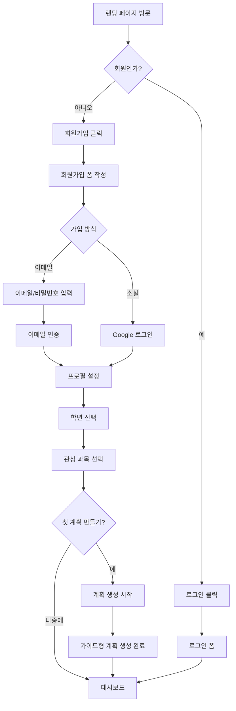
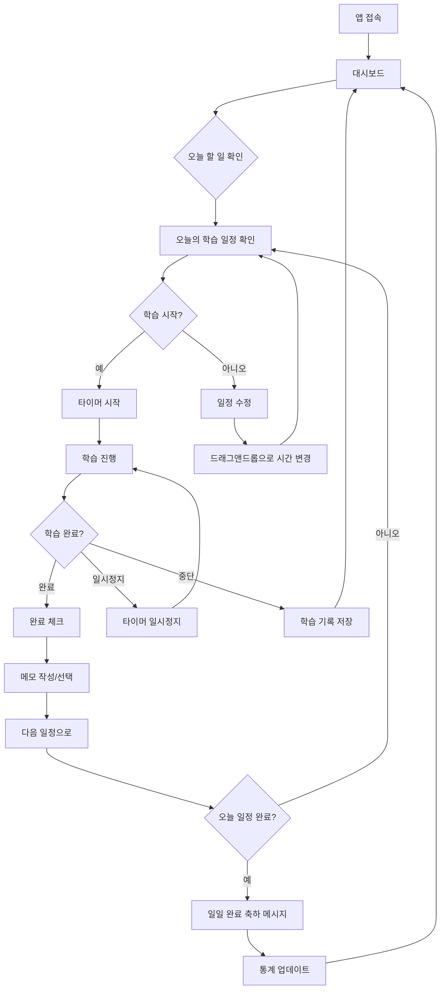
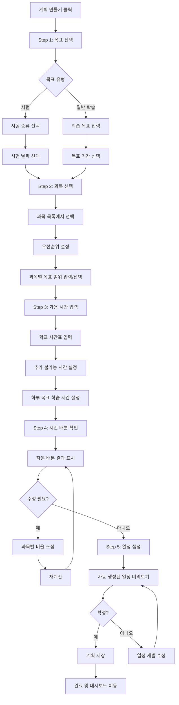
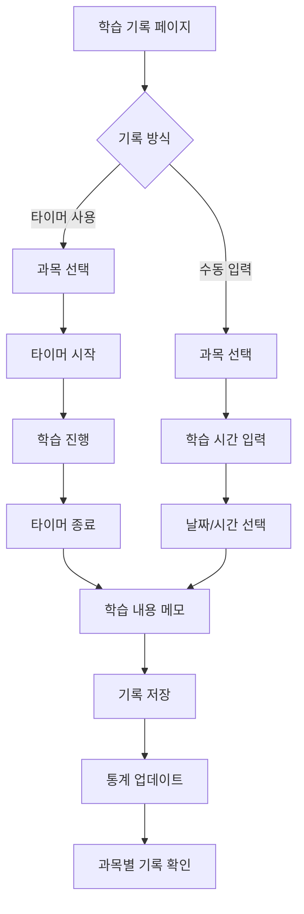
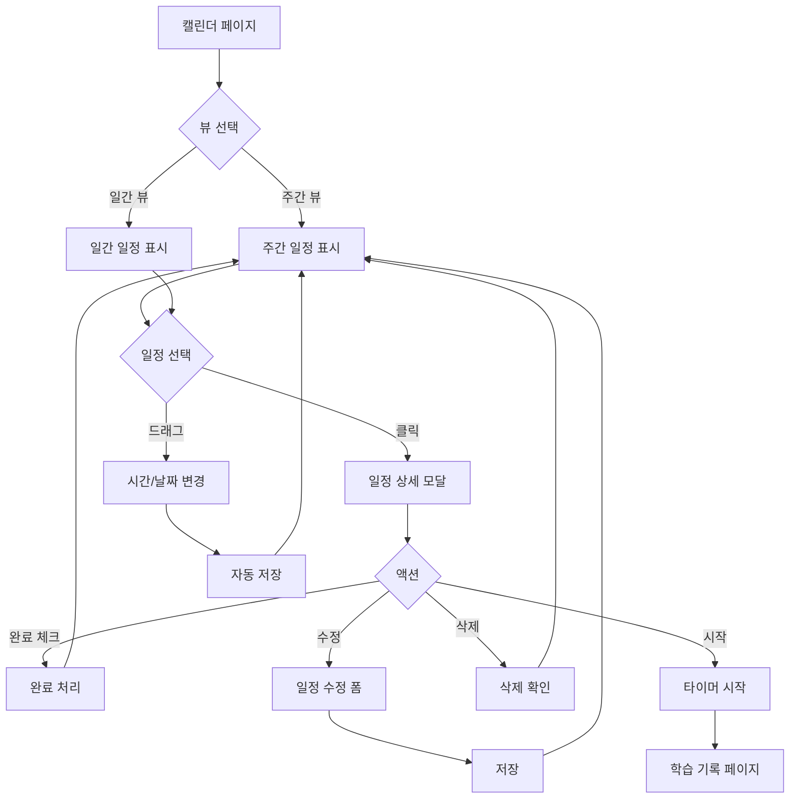
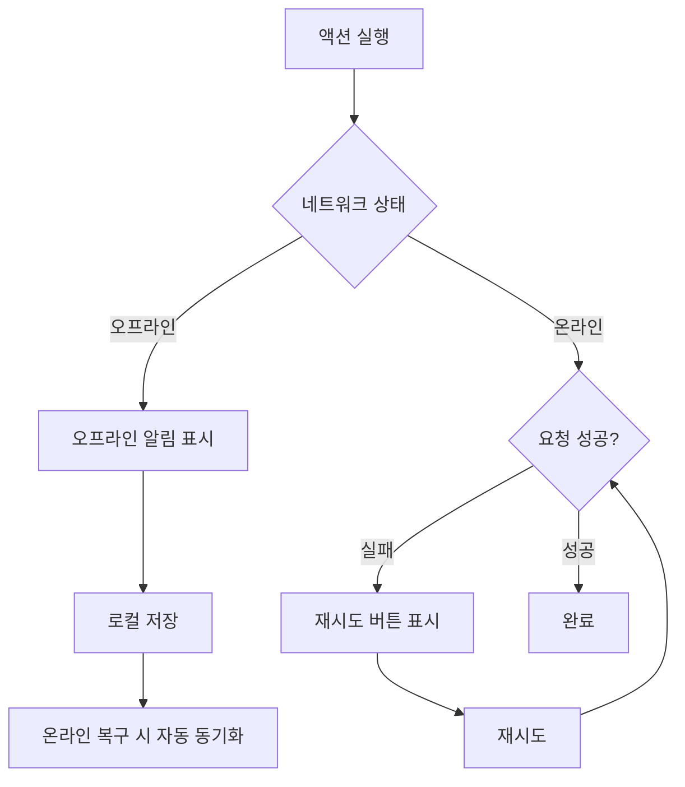
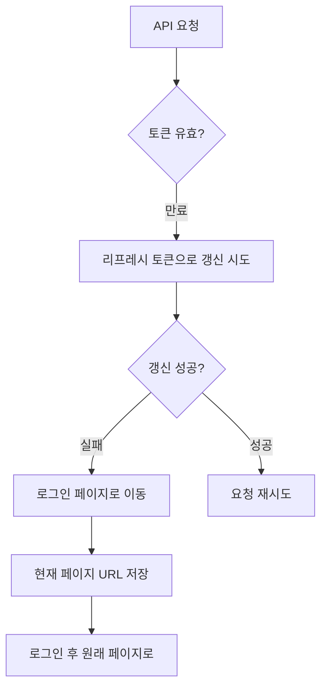

# StudyMate User Flows Overview

## Overview

StudyMate는 고등학생이 스스로 공부 계획을 세우고 실행할 수 있도록 돕는 웹 서비스입니다.
이 문서는 전체 사용자 플로우의 개요와 주요 태스크별 플로우를 정리합니다.

### 타겟 사용자
- **페르소나**: 고등학생 (15-18세)
- **목표**: 시험 대비 또는 학습 계획 수립 및 실행
- **특성**:
  - 계획 수립에 어려움을 느낌
  - 동기부여와 성취감이 중요
  - 모바일 사용 빈도 높음

### 핵심 가치 제안
- **가이드형 계획 생성**: 복잡한 계획 수립을 단계별로 쉽게
- **자동 시간 배분**: AI 기반 최적 학습 시간 추천
- **진행 추적**: 실시간 학습 기록 및 통계

---

## Site Map

```
StudyMate
├── 랜딩 (/)
│   └── [비로그인 사용자 대상]
│
├── 인증
│   ├── 로그인 (/login)
│   ├── 회원가입 (/signup)
│   └── 비밀번호 찾기 (/forgot-password)
│
├── 대시보드 (/dashboard) [Auth Required]
│   ├── 오늘 진행률
│   ├── 주간 통계
│   ├── 연속 학습일
│   └── 빠른 액션
│
├── 계획 생성 (/plan/new) [Auth Required]
│   ├── Step 1: 목표 선택
│   ├── Step 2: 과목 선택
│   ├── Step 3: 가용 시간 입력
│   ├── Step 4: 시간 배분 확인
│   └── Step 5: 완료
│
├── 주간 캘린더 (/calendar) [Auth Required]
│   ├── 주간 뷰
│   ├── 일간 뷰
│   └── 일정 상세/수정
│
├── 학습 기록 (/records) [Auth Required]
│   ├── 타이머
│   ├── 과목별 기록
│   └── 메모
│
└── 설정 (/settings) [Auth Required]
    ├── 프로필 수정
    ├── 알림 설정
    └── 계정 관리
```

---

## User Flow Diagrams

### 1. 신규 사용자 온보딩 플로우



**핵심 포인트**:
- 회원가입 후 바로 첫 계획 생성으로 유도
- 프로필 설정은 최소 정보만 (학년, 관심 과목)
- 3클릭 이내에 핵심 가치 경험

**상세 문서**: [flow-onboarding.md](./flow-onboarding.md)

---

### 2. 기존 사용자 일일 사용 플로우



**핵심 포인트**:
- 대시보드에서 모든 정보 한눈에
- 타이머로 학습 시간 자동 기록
- 완료 시 성취감을 주는 피드백
- 유연한 일정 수정 (드래그앤드롭)

**상세 문서**: [flow-daily-study.md](./flow-daily-study.md)

---

### 3. 계획 생성 플로우 (핵심 기능)



**핵심 포인트**:
- 5단계 가이드형 (위자드 패턴)
- 각 단계에서 진행률 표시
- 자동 계산 결과를 사용자가 수정 가능
- 최종 확인 전 미리보기 제공

**상세 문서**: [flow-plan-creation.md](./flow-plan-creation.md)

---

### 4. 학습 기록 플로우



---

### 5. 일정 관리 플로우



---

## Task-based User Flows

### 주요 태스크별 클릭 수

| 태스크 | 시작점 | 클릭 수 | 경로 |
|--------|--------|---------|------|
| 오늘 학습 시작 | 대시보드 | 2 | 대시보드 -> 일정 클릭 -> 시작 버튼 |
| 새 계획 생성 | 대시보드 | 6 | 대시보드 -> 계획 만들기 -> 5단계 위자드 |
| 일정 완료 체크 | 대시보드 | 2 | 대시보드 -> 일정 클릭 -> 완료 체크 |
| 학습 기록 확인 | 대시보드 | 2 | 대시보드 -> 기록 메뉴 -> 과목 선택 |
| 일정 시간 변경 | 캘린더 | 1 | 드래그앤드롭 |
| 프로필 수정 | 대시보드 | 3 | 대시보드 -> 설정 -> 프로필 -> 저장 |

---

## Navigation Structure

### Global Navigation (Header)

**비로그인 상태**
```
[Logo]                              [로그인] [회원가입]
```

**로그인 상태**
```
[Logo]  [대시보드] [캘린더] [학습기록]        [알림] [프로필]
```

**모바일 (로그인 상태)**
```
[Menu]  [Logo]                              [알림]

// 하단 탭 바
[대시보드] [캘린더] [+ 계획] [기록] [설정]
```

### 하단 탭 바 구성 (Mobile)

| 아이콘 | 라벨 | 경로 | 설명 |
|--------|------|------|------|
| Home | 대시보드 | /dashboard | 메인 화면 |
| Calendar | 캘린더 | /calendar | 일정 관리 |
| + | 계획 만들기 | /plan/new | 새 계획 생성 (강조) |
| Clock | 학습기록 | /records | 기록 및 타이머 |
| User | 설정 | /settings | 프로필 및 설정 |

---

## Error Handling Flows

### 네트워크 오류



### 인증 만료



---

## Key UX Principles Applied

### Nielsen's Heuristics

| 원칙 | 적용 |
|------|------|
| 시스템 상태 가시성 | 계획 생성 진행률, 학습 타이머, 로딩 상태 |
| 사용자 제어와 자유 | 계획 수정, 일정 드래그앤드롭, Undo |
| 일관성과 표준 | 동일한 버튼 스타일, 네비게이션 패턴 |
| 에러 예방 | 필수 입력 검증, 삭제 전 확인 |
| 에러 복구 지원 | 명확한 에러 메시지, 재시도 버튼 |

### UX Laws

| 법칙 | 적용 |
|------|------|
| 3클릭 규칙 | 핵심 태스크 3클릭 이내 (계획 생성 제외, 위자드라 예외) |
| 힉의 법칙 | 과목 선택 시 카테고리 분류, 단계별 진행 |
| 밀러의 법칙 | 대시보드 정보 그룹화, 5개 이하 탭 |
| 피츠의 법칙 | 주요 CTA 크게, 모바일 하단 배치 |

---

## Related Documents

- [온보딩 플로우 상세](./flow-onboarding.md)
- [계획 생성 플로우 상세](./flow-plan-creation.md)
- [일일 학습 플로우 상세](./flow-daily-study.md)
- [와이어프레임](/design/wireframes/)
- [정보 구조](/design/ia/)
